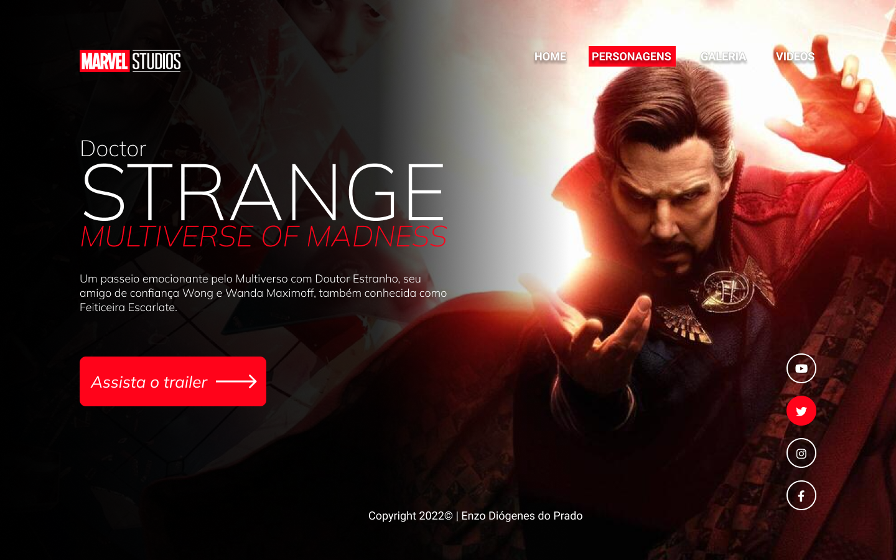
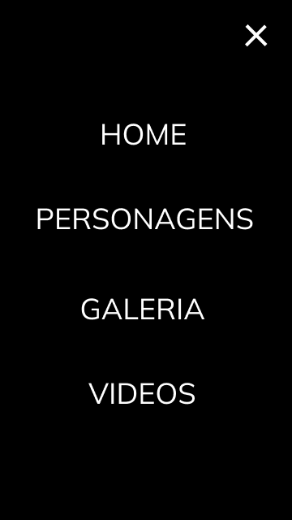

# Doctor Strange
Projeto construido durante as aulas de LIMA, no curso de desenvolvimento de sistemas do[SENAI Jandira](https://jandira.sp.senai.br/), com orientação do Prof. [Fernando Leonid](https://github.com/fernandoleonid)

</img>
</img>

---

## Qual era o objetivo do projeto?
O objetivo era criar uma landing page com base no design feito no figma, aprendendo a estrutura do HTML, CSS e JS e conceitos de responsividade

---
## O que é uma Landing Page?
Landing Pages são páginas com foco principal na conversão de visitantes, assim, essas páginas possuem estética mais minimalista comparada com os sites tradicionais.

---

## Teconologias Usadas
- HTML 5
- CSS 3
- Javascript
- Figma

---

## Links
- [Resultado](enzodprado.github.io/strange/)
- [Projeto no Figma](https://www.figma.com/file/XipMWcyBPWSmX1EVuaP1cq/Lima-Strange2?node-id=9%3A56)
- [Código](https://github.com/EnzoDPrado/Strange)

## Autor
[Enzo Diógenes do Prado](https://github.com/EnzoDPrado)